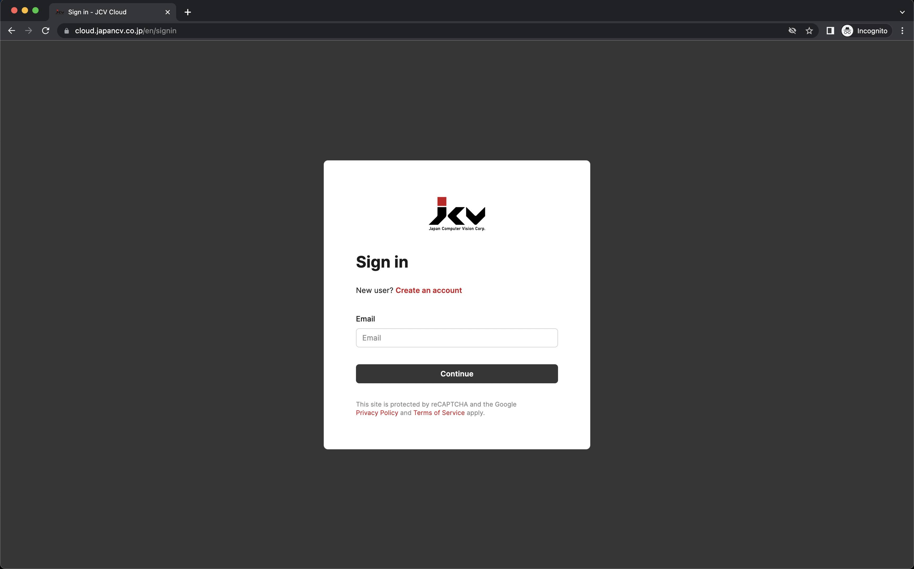
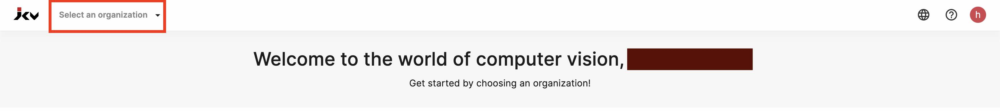
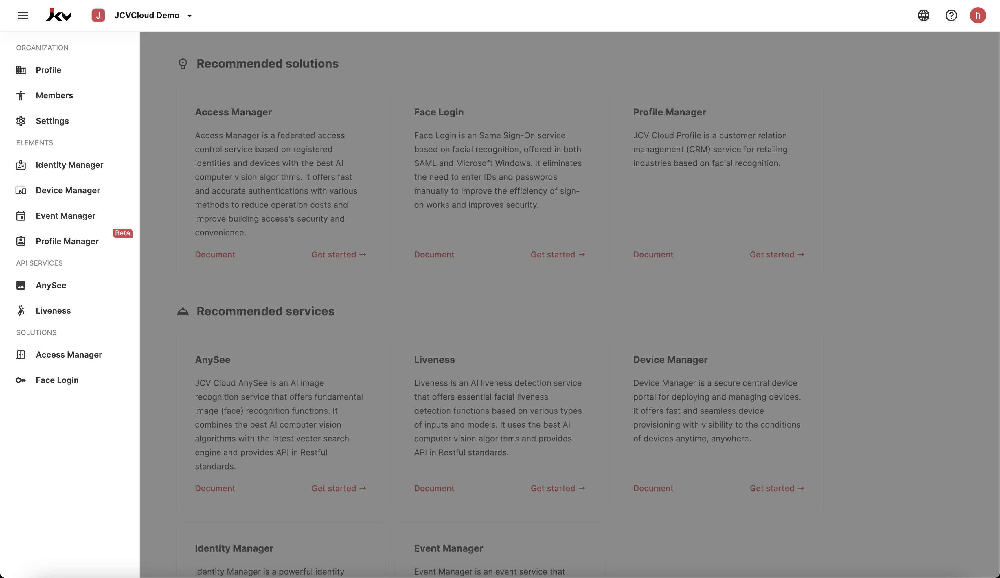
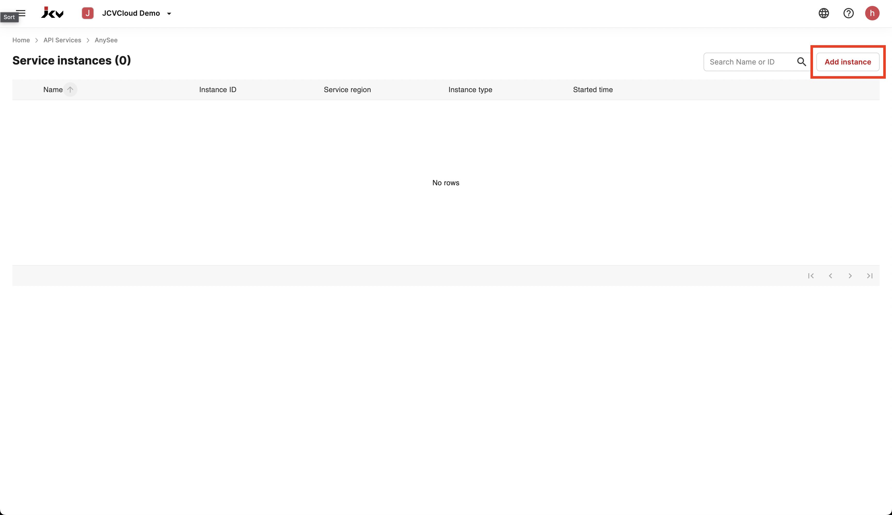
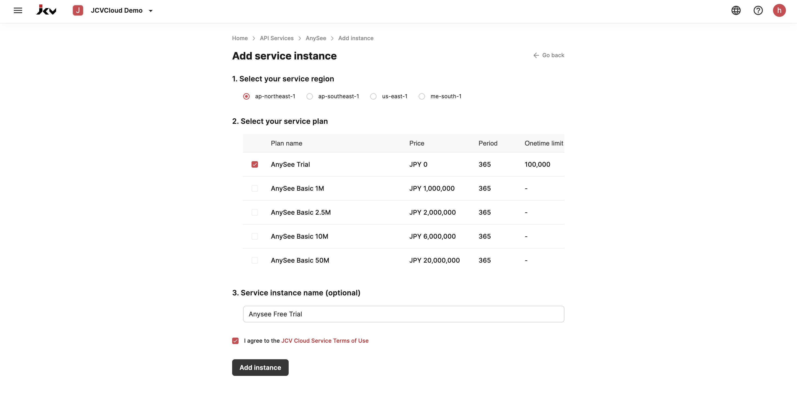
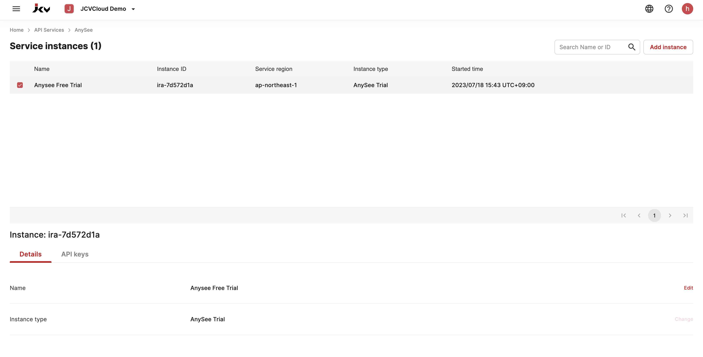
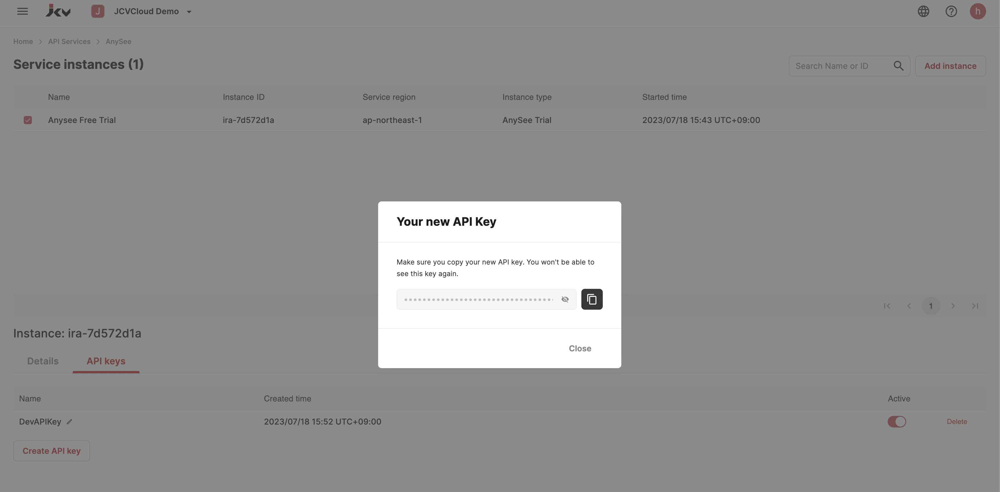

Welcome to our detailed tutorial on how to register for the JCV Cloud and set up an Anysee instance. The Anysee service is a free openAPI that provides capabilities for face recognition, face detection, face attributes (such as age, gender, and emotion detection), face quality detection, and more. 

Step 1: Register for an Account
--------------------------------
Start by navigating to the JCV Cloud homepage at [https://cloud.japancv.co.jp/en/login](https://cloud.japancv.co.jp/en/login). 

Click on "Create an Account" to initiate your registration process. It's quick and simple, as most of the fields are optional. 

Step 2: Create a New Organization
---------------------------------
Upon successful registration and login, you'll be directed to a blank page. 

Navigate to "Select an organization" on the top left corner and create a new organization. Although most of the fields are optional, filling them in can help keep your workspace organized.

Step 3: Access Anysee Service
-----------------------------
After you've set up an organization, click on it. You'll now see an array of features that you can explore. Select 'Anysee' from the left column; this is JCV's official openAPI service. 

For more details, consult the [official documentation](https://docs.cloud.japancv.co.jp/docs/introduction). You'll find that Anysee is also currently the world's leading face recognition service as per the [Benchmark report](report).

Step 4: Add an Instance
------------------------
Click on the 'Add instance' button located at the top right corner. Consider an instance as an independent device (like one installed at your building's front door). Each device owns an instance along with an instance ID. 

For this tutorial, select the 'Trial plan' and set the instance running. As an example, we'll choose 'ap-northeast-1' for the service region, which represents the North East of the Asian Pacific Region, with the server located in Japan. 

Click 'Add instance'. You're nearly there!

Step 5: Generate an API Key
---------------------------
Congratulations, you've set up your first instance! Click on the 'API keys' tab under your instance ID.

Create a new API key and keep it in a safe location. Remember, once you navigate away from this page, you won't be able to see the key again. If you misplace it, you'll have to create a new one. 

And there you have it! You've successfully created your first instance and generated an API key. Now, you're ready to explore the powerful features of Anysee. Enjoy your journey!