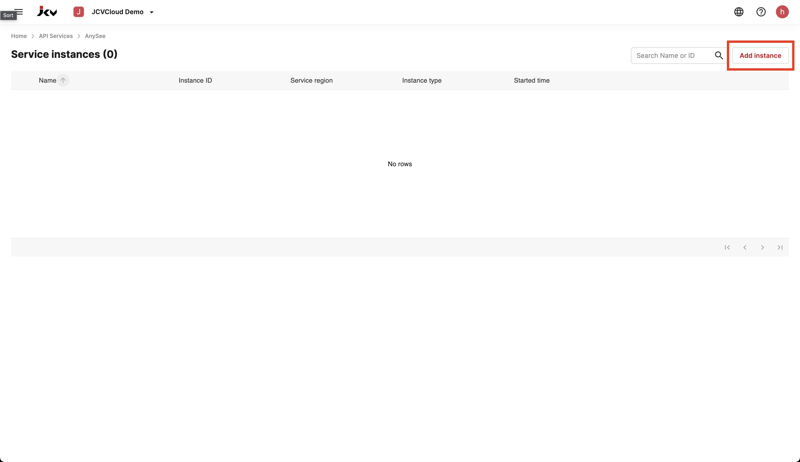
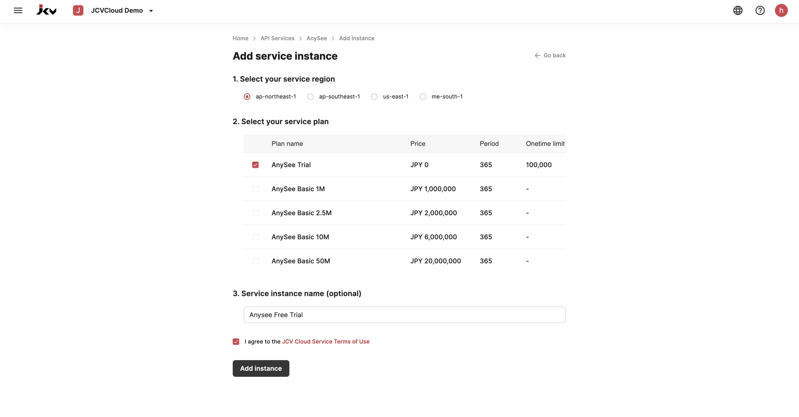

ようこそ、JCV Cloudへの登録からAnyseeインスタンスをセットアップまでのチュートリアルへ。Anyseeサービスは、顔認識、顔検出、顔属性（年齢、性別、感情検出など）、顔品質検出などの機能を提供する無料のopenAPIです。

ステップ1: アカウントを登録する
--------------------------------
JCV Cloudのホームページ [https://cloud.japancv.co.jp/signin](https://cloud.japancv.co.jp/signin) にアクセスしてください。

「アカウントを作成してください」をクリックして登録プロセスを開始します。ほとんどのフィールドはオプションなので、簡単に登録できます。

ステップ2: 新しい組織を作成
---------------------------------
登録とログインに成功すると、この空白のページに進みます。

左上の「組織を選択」に選択して、新しい組織を作成します。ほとんどのフィールドはオプションですが、入力するとワークスペースを整理しやすくなります。

ステップ3: Anyseeサービスにアクセス
-----------------------------
組織を設定したら、それをクリックします。さまざまな機能を探索できるページが表示されます。左の列から'Anysee'を選択します。これはJCVの公式openAPIサービスです。

詳細は、[公式ドキュメント](https://docs.cloud.japancv.co.jp/docs/introduction)を参照してください。Anyseeは、[ベンチマークレポート](report)によると、現在世界で最も優れた顔認識サービスでもあります。

ステップ4: インスタンスを追加
------------------------
右上の「インスタンスを追加」ボタンをクリックしてください。インスタンスを独立したデバイス（ビルの正面のドアに設置されているものなど）と考えてください。各デバイスにはインスタンスとインスタンスIDがあります。

このチュートリアルでは、「トライアルプラン」を選択し、インスタンスを実行します。サービス地域として「ap-northeast-1」を選ぶことを例にします。これは、アジア太平洋地域の北東を表し、サーバーは日本に位置しています。

「インスタンスを追加」をクリックします。もうすぐ完了です！

ステップ5: APIキーを生成
---------------------------
おめでとうございます、初めてのインスタンスを設定しました！インスタンスIDの下の「APIキー」タブをクリックしてください。

新しいAPIキーを作成し、安全な場所に保管してください。このページから移動すると、キーを再表示することはできません。紛失した場合、新しいものを作成する必要があります。

以上で完了です！インスタンスを正常に作成し、APIキーを生成しました。これで、Anyseeの強力な機能を探索する準備が整いました。楽しい冒険を！
